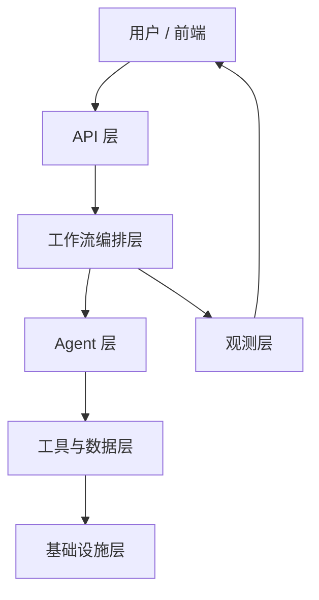
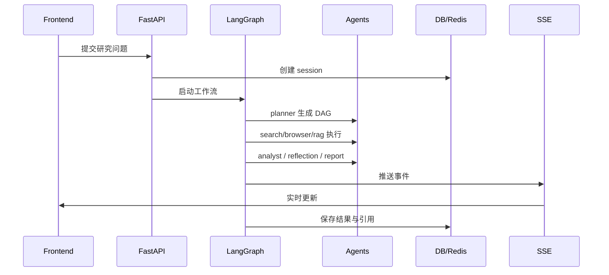

# DeepIntel 架构层级说明

> 目标：说明当前系统是如何分层组织的，每一层负责什么，以及这些职责落在哪些文件上。

## 结论

当前架构属于 **集中式编排的 multi-agent 系统**。

它不是多个 Agent 自由协商的去中心化结构，而是：

`UI -> API -> LangGraph 编排层 -> Agent 层 -> 工具/数据层 -> 基础设施`

核心特点：

- 由一个主工作流统一调度
- Agent 按职责拆分，但共享同一条研究状态
- 通过 DAG + 条件边 + 检查点实现可恢复的执行
- 通过 SSE 把运行过程实时推给前端

---

## 分层总览

---

## 第 1 层：交互层

### 职责

- 接收用户输入
- 展示研究状态、工具调用、最终报告
- 配置 LLM、查看文档、切换研究界面

### 主要文件

- `frontend/src/App.tsx`
- `frontend/src/components/ResearchDashboard.tsx`
- `frontend/src/components/AgentTrace.tsx`
- `frontend/src/components/ToolTrace.tsx`
- `frontend/src/components/ReportPreview.tsx`
- `frontend/src/components/LLMConfigPanel.tsx`
- `frontend/src/hooks/useSSE.ts`

### 说明

这一层不负责业务决策，只负责把后端事件流和最终结果渲染出来。

---

## 第 2 层：API 层

### 职责

- 暴露 HTTP 接口
- 创建研究会话
- 查询状态与结果
- 提供健康检查和运行时配置接口

### 主要文件

- `app/main.py`
- `app/api/health.py`
- `app/api/research.py`
- `app/api/config.py`

### 说明

这一层是系统入口，负责把前端请求转成研究任务，并把 LangGraph 工作流挂到后台执行。

---

## 第 3 层：工作流编排层

### 职责

- 定义全局研究状态
- 生成和执行研究 DAG
- 控制并行、分支、重规划和结束条件
- 维护会话级检查点

### 主要文件

- `app/graph/state.py`
- `app/graph/compiler.py`
- `app/graph/nodes.py`
- `app/graph/edges.py`

### 说明

这是当前架构的核心控制层。  
研究不是固定流水线，而是先由 `planner` 生成 DAG，再按状态机方式调度各个节点。

---

## 第 4 层：Agent 层

### 职责

- 将研究任务拆分到不同能力单元
- 分别负责规划、搜索、浏览、检索、分析、校验、报告生成

### 主要文件

- `app/agents/planner.py`
- `app/agents/search.py`
- `app/agents/browser.py`
- `app/agents/rag.py`
- `app/agents/analyst.py`
- `app/agents/reflection.py`
- `app/agents/report.py`
- `app/agents/browser_demo.py`

### 当前角色边界

- `planner`：把问题拆成 DAG
- `search`：快速事实检索
- `browser`：网页深度抓取
- `rag`：知识库检索
- `analyst`：综合证据形成分析
- `reflection`：校验质量并决定是否重规划
- `report`：输出最终报告

### 说明

这些 Agent 不是彼此独立运行的进程，而是由编排层按需调用的功能模块。

---

## 第 5 层：工具与数据层

### 职责

- 提供搜索、浏览、检索能力
- 管理数据库、向量检索、引用与会话持久化
- 封装对外部服务的访问

### 主要文件

- `app/tools/search_tools.py`
- `app/tools/browser_tools.py`
- `app/tools/retrieval_tools.py`
- `app/rag/embedder.py`
- `app/rag/retriever.py`
- `app/rag/reranker.py`
- `app/db/connection.py`
- `app/db/models.py`
- `app/db/migrate.py`
- `app/llm_client.py`

### 说明

这一层提供实际能力和数据落点：

- 搜索来源
- 网页内容提取
- 向量检索
- PostgreSQL 持久化
- Redis 会话与缓存

---

## 第 6 层：观测与运行层

### 职责

- 输出 Agent trace
- 推送 SSE 事件
- 记录结构化日志
- 统计指标与调试信息

### 主要文件

- `app/observability/sse_manager.py`
- `app/observability/trace.py`
- `metrics/`
- `scripts/preload_models.py`
- `scripts/download_all_models.py`
- `start-deepintel.ps1`
- `docker-compose.yml`

### 说明

这一层不直接参与研究推理，但决定系统是否可观测、可恢复、可部署。

---

## 当前执行链路

---

## 架构判断

### 这是 multi-agent 吗

是，但属于 **集中式编排 multi-agent**。

### 关键原因

- 多个职责单元确实存在
- 但它们共享同一状态
- 由一个编排器统一调度
- 没有独立自治的 Agent 间对话协议

### 设计取舍

| 方案 | 优点 | 缺点 |
|---|---|---|
| 集中式编排 multi-agent | 可控、易观测、易调试 | 自主性较弱 |
| 去中心化多 Agent | 灵活、自治性强 | 难调试、难收敛 |

当前项目选择前者，是因为研究系统更需要可追踪、可验证、可恢复。

---

## 文件映射速查

| 层级 | 文件 |
|---|---|
| 交互层 | `frontend/src/App.tsx` |
| 交互层 | `frontend/src/components/ResearchDashboard.tsx` |
| API 层 | `app/main.py` |
| API 层 | `app/api/research.py` |
| 编排层 | `app/graph/compiler.py` |
| 状态层 | `app/graph/state.py` |
| Agent 层 | `app/agents/*.py` |
| 工具层 | `app/tools/*.py` |
| 数据层 | `app/db/*.py` |
| 观测层 | `app/observability/*.py` |

---

## 一句话总结

DeepIntel 当前架构是一个 **前端驱动、API 入口、LangGraph 统一编排、Agent 分工执行、工具层落地、观测层兜底** 的集中式多 Agent 研究系统。

