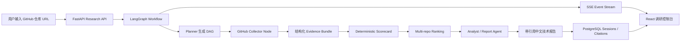

# GitHub Research Agent 简历与面试讲解材料

这份材料用于简历描述、面试自我介绍、现场 Demo 和追问准备。核心口径是：项目不是简单复刻 DeepIntel，而是在跑通 baseline 后，把它改造成一个垂直场景的 GitHub 开源项目技术调研 Agent。

## 一句话介绍

基于 DeepIntel 二次改造的 GitHub 开源项目技术调研 Agent：输入一个或多个公开 GitHub 仓库 URL，系统自动采集结构化证据、进行确定性评分与多仓库排序，并生成带引用、可追溯、可恢复历史记录的中文技术选型报告。

## 简历项目描述

```text
GitHub 开源项目技术调研 Agent

基于 LangGraph、FastAPI、React、Docker 和 Qwen/DashScope 构建的多 Agent 技术调研系统。项目从 DeepIntel 复现起步，扩展出 GitHub 仓库证据采集、Pydantic 结构化证据模型、确定性评分、多仓库对比排序、SSE 实时轨迹、历史报告恢复和中文技术报告模板，支持面向简历/面试复刻场景的开源项目选型分析。
```

可放进简历的 bullet：

- 复现并改造 DeepIntel 多 Agent 研究系统，跑通 Docker Compose、FastAPI、React、LangGraph、SSE 和 Qwen/DashScope 端到端报告生成链路。
- 设计 GitHub 仓库结构化证据模型，采集 metadata、README、文件树、依赖清单、Docker、CI、测试、license 和活跃度信号。
- 实现确定性 scorecard 和多仓库 ranking，按可复现性、项目深度、技术栈广度、可扩展性、工程质量、风险控制等维度输出稳定排序。
- 将 GitHub collector 节点接入 LangGraph 工作流，保留原有 Planner、Analyst、Reflection、Report 流程，并把证据、评分和引用注入报告生成路径。
- 建设 React 调研控制台，支持 GitHub prompt 生成、SSE Agent 轨迹、工具调用、GitHub 看板、Scorecard 表格、引用面板、历史报告恢复和 Demo 样例闭环。

## 技术栈

| 层级 | 技术与作用 |
| --- | --- |
| Agent 编排 | LangGraph、Planner、GitHub Collector、Analyst、Reflection、Report |
| 后端 API | FastAPI、Pydantic、async workflow、SSE |
| 模型接入 | DashScope OpenAI-compatible API、Qwen，可替换 LLM provider |
| GitHub 证据 | GitHub REST API、raw README、文件树、依赖清单、CI/Docker/license/test signals |
| 评分排序 | 结构化 evidence model、deterministic scorecard、weighted ranking |
| 前端 | React、TypeScript、Vite、Tailwind CSS |
| 持久化 | PostgreSQL、pgvector、Redis、research sessions、citations、agent trace、tool histories |
| 工程化 | Docker Compose、环境变量模板、中文 SDK 文档、Demo evaluation、样例报告和截图 |

## 架构图



核心数据流：

`Repository Input -> GitHub Evidence Collection -> Deterministic Scoring -> Ranking -> LLM Synthesis -> Cited Report -> History Recovery`

## 我做了哪些改造

1. Baseline 复现  
   跑通 DeepIntel 原始链路，包括 Docker Compose、FastAPI、React、LangGraph、SSE、PostgreSQL、Redis 和真实 Qwen 端到端报告。

2. 模型与网络接入  
   接入 DashScope OpenAI-compatible API，解决 Docker 容器内访问 DashScope 的代理与 TLS EOF 问题。关键判断方法是：容器内通过代理请求 `/compatible-mode/v1/models` 得到 `401`，证明 TLS 和代理链路已通。

3. GitHub 证据模型  
   新增 GitHub URL 解析、仓库身份、metadata、README signals、file tree signals、dependency manifests、CI/Docker/test/license signals 等结构化字段。

4. GitHub Collector  
   使用公开 GitHub REST/raw endpoints 采集证据，`GITHUB_TOKEN` 可选；配置 token 后提高 rate limit，适合真实 Demo。

5. 确定性评分与排序  
   按六个维度生成 scorecard，并通过加权规则稳定输出多仓库 ranking。LLM 只负责解释证据，不负责凭空改分或改排序。

6. LangGraph 工作流接入  
   没有重写一条孤立 pipeline，而是在原 research workflow 中插入 GitHub 节点，把 evidence、scorecard、ranking 注入 Analyst 和 Report 阶段。

7. 中文技术报告模板  
   报告从泛化研究报告改成 GitHub 技术调研结构，包含评分总览、可复现性、架构深度、技术栈、可扩展性、工程质量、风险和面试展示建议。

8. 前端展示适配  
   增加 GitHub 仓库输入、Demo prompt 复制、GitHub 看板、ranking 表格、Scorecard 表格、报告引用计数、历史记录和报告恢复。

9. 可观测与恢复  
   前端通过 SSE 展示 Agent trace 和 Tool trace；历史报告恢复时从 `agent_trace` 和 `tool_histories` 还原轨迹，旧数据缺失时从报告和引用做 best-effort 恢复。

10. Demo 评测闭环  
    保存真实端到端 Demo 的报告、引用、运行摘要、HTML 预览和截图，形成面试可展示证据。

## 核心难点与解决方案

### 1. Docker 容器内 DashScope TLS EOF

问题：宿主机能访问 DashScope，但 API 容器内请求出现 TLS EOF。

解决：

- 使用 `host.docker.internal:7890` 让容器走宿主机代理。
- 在代理客户端开启“允许局域网连接”。
- 使用 DashScope 国际站 OpenAI-compatible endpoint。
- 修改 `.env` 后执行 `docker compose up -d --force-recreate api`，确保容器读到新环境变量。
- 用不带 API key 的 models 请求拿到 `401` 验证链路通，而不是只看最终 LLM 调用。

### 2. 不破坏 DeepIntel baseline 的前提下接入 GitHub 工作流

问题：如果为了 GitHub 场景重写整条报告 pipeline，会失去复现项目本身的价值。

解决：

- 保留 Planner、Search、RAG、Browser、Analyst、Reflection、Report 架构。
- 识别 GitHub URL 后插入 GitHub collection node。
- 把 GitHub evidence 转成标准 report evidence，并保留 provenance URL。
- 让 GitHub 任务复用原有 SSE、持久化和报告生成能力。

### 3. 避免 LLM 主观打分

问题：直接问 LLM “哪个项目更好”不稳定，面试时很难解释。

解决：

- 先采集结构化证据，再用固定规则计算 scorecard。
- 排名由 deterministic weighted ranking 产生。
- LLM 只做 synthesis：解释为什么这个分数和排序合理。

### 4. 引用与证据可追溯

问题：报告里如果只有结论，没有证据链，容易变成“看起来像分析”的幻觉输出。

解决：

- 每条 citation 保留 `citation_id`、source URL、title、source type、extracted evidence。
- 报告引用 `[citation:N]` 和引用面板对应。
- 前端区分“报告实际使用引用”和“工作流采集来源”，避免把 30 条采集源误说成 30 条报告引用。

### 5. 历史报告恢复

问题：刷新页面或打开历史报告时，报告有了，但 Agent 轨迹、工具调用和 GitHub 看板容易丢失。

解决：

- 后端返回并持久化 `agent_trace` 与 `tool_histories`。
- 前端把历史 trace/tool history 转成 SSE 风格事件，复用现有 AgentTrace 和 ToolTrace 组件。
- 如果旧 session 没保存 trace，则从 query、report、citations 恢复简化轨迹，保证演示不空白。

## 面试讲解稿

### 1 分钟版本

我这个项目是从 DeepIntel 复现开始做的，先跑通了 LangGraph、FastAPI、React、Docker 的多 Agent 深度研究系统，然后把它改造成 GitHub 开源项目技术调研 Agent。用户输入几个 GitHub 仓库 URL，系统会先采集结构化证据，比如 README、依赖、测试、CI、Docker、license 和活跃度，再用确定性规则给出可复现性、项目深度、技术栈广度等评分，最后由 LLM 生成带引用的中文技术选型报告。它不是让 LLM 主观判断哪个项目好，而是让 LLM 解释已经采集和评分好的证据。

### 3 分钟版本

项目分两阶段。第一阶段是复现 DeepIntel，保证原来的 Agent 工作流、SSE、报告和 Docker 环境都能真实跑通。我接入的是 DashScope 的 Qwen OpenAI-compatible API，中间处理了容器内访问 DashScope 的代理和 TLS EOF 问题。

第二阶段是二次改造成 GitHub Research Agent。我新增了 GitHub URL 解析、公开仓库 collector、Pydantic 证据模型、确定性 scorecard、多仓库 ranking 和中文报告模板。LangGraph 上不是重写一条新管线，而是在原来的 research workflow 里插入 GitHub collection node，然后把证据注入 Analyst 和 Report 阶段。

这个项目的关键设计是把“事实”和“表达”分开。事实部分由 GitHub API 和确定性规则产生，包含 provenance URL；表达部分才交给 LLM。这样报告既有可读性，又不会完全依赖 LLM 主观判断。前端则通过 SSE 实时展示 Agent trace、工具调用、GitHub ranking 和最终报告，并且支持历史报告恢复，适合面试现场演示。

## 高频追问回答

**Q: 为什么不直接让 LLM 判断哪个仓库最好？**

因为直接判断不可复现，容易受 prompt 和模型波动影响。我把仓库信息先结构化，再用固定评分规则排序，LLM 只做解释和报告生成。

**Q: GitHub Token 是必须的吗？**

不是。公开仓库在未触发 rate limit 时可以匿名采集。但真实 Demo 推荐配置 `GITHUB_TOKEN`，可以提高 rate limit，也方便错误提示更清楚。

**Q: 这个项目和普通爬虫有什么区别？**

普通爬虫主要采集内容，这个项目还有证据建模、评分、排序、Agent 工作流、报告生成和可观测性。它的目标是技术选型，不只是抓取网页。

**Q: 最大技术难点是什么？**

三个点：第一是 Docker 容器内代理和模型 API 连通性；第二是把 GitHub 证据稳定注入 LangGraph 工作流；第三是把 LLM 主观判断收敛到 evidence-backed report。

**Q: 如何证明报告可信？**

报告结论来自结构化 evidence bundle 和 deterministic scorecard，每个重要结论都带 citation。前端还显示引用来源、实际使用引用数和采集来源数，方便复盘。

**Q: 如果继续扩展，你会做什么？**

我会扩展评测集，加入更多仓库类别；增加 GitHub Actions 自动回归；把 scorecard 权重做成可配置；再加报告导出 PDF/Markdown 和项目对比矩阵。

## Demo 展示顺序

1. 打开前端首页，说明这是 DeepIntel baseline 改造成的 GitHub Research Agent。
2. 进入研究页，点击使用三项目对比示例。
3. 点击复制 Demo prompt 或生成 GitHub 调研任务。
4. 展示 GitHub 技术调研看板，说明检测到的仓库、推荐仓库和 ranking。
5. 展示 Agent 轨迹与工具调用，强调 SSE 实时可观测和历史恢复。
6. 展示报告中的 Scorecard 表格，强调第一名是确定性评分得到的。
7. 展示引用面板，说明“报告引用 16 / 采集来源 30”的区别。
8. 打开 `docs/demo` 里的样例报告、引用和截图，证明做过真实端到端 Demo。
9. 最后讲解架构图和核心难点。

## 可展示产物

- `docs/demo/sample_report.md`
- `docs/demo/sample_result_summary.json`
- `docs/demo/sample_citations.json`
- `docs/demo/sample_report_preview.html`
- `docs/demo/screenshots/01_frontend_home.png`
- `docs/demo/screenshots/02_sample_report_preview.png`
- `docs/DEMO_EVALUATION.md`
- `docs/SDK_USAGE.md`
- `docs/INTERVIEW_GUARDRAILS.md`

## 当前项目完成度

已完成：

- DeepIntel baseline 复现
- Qwen/DashScope 接入
- GitHub evidence model
- GitHub collector
- deterministic scorecard
- multi-repo ranking
- GitHub report template
- React GitHub research UI
- SSE Agent/Tool trace
- history restore
- Demo sample and evaluation loop
- Chinese startup and SDK docs
- interview presentation materials

后续可选增强：

- 打 `v1.0-demo` tag
- 增加 PDF/Markdown 导出按钮
- 增加更多固定评测集
- 增加 CI 自动跑 compare smoke test
- 将 scorecard 权重配置化
