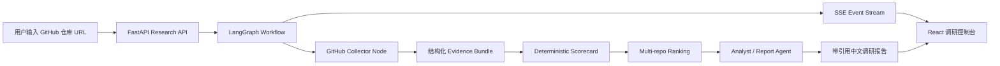

# GitHub Research Agent 简历与面试讲解材料

## 一句话介绍

基于 DeepIntel 二次改造的 GitHub 开源项目技术调研 Agent：输入一个或多个公开 GitHub 仓库 URL，系统自动采集结构化证据、进行确定性评分与排序，并生成带引用的中文技术选型报告。

## 简历项目描述

```text
GitHub 开源项目技术调研 Agent

基于 LangGraph、FastAPI、React、Docker 和 Qwen/DashScope 构建的多 Agent 技术调研系统。项目从 DeepIntel 复现起步，扩展出 GitHub 仓库证据采集、确定性评分、多仓库对比排序、SSE 实时执行轨迹和中文技术报告模板，支持面向简历/面试复刻场景的开源项目选型分析。
```

## 技术栈

| 层级 | 技术 |
| --- | --- |
| Agent 编排 | LangGraph、Planner、GitHub Collector、Analyst、Reflection、Report |
| 后端 API | FastAPI、Pydantic、async workflow、SSE |
| 模型接入 | DashScope OpenAI-compatible API、Qwen、可替换 LLM provider |
| GitHub 证据 | GitHub REST API、raw README、文件树、依赖清单、CI/Docker/license/test signals |
| 评分排序 | 结构化 evidence model、deterministic scorecard、weighted ranking |
| 前端 | React、TypeScript、Vite、Tailwind CSS |
| 基础设施 | Docker Compose、PostgreSQL、pgvector、Redis |
| 文档与评测 | Demo evaluation、sample report、citation artifacts、screenshots |

## 架构图



## 我做了哪些改造

- 复现 DeepIntel 基线：跑通 Docker Compose、FastAPI、React、LangGraph、SSE 和真实 Qwen 端到端报告。
- 接入 Qwen/DashScope：使用 OpenAI-compatible API，并解决容器内代理、TLS EOF 和环境变量重建问题。
- 增加 GitHub URL 解析：支持普通 GitHub URL 和 `owner/repo` 形式。
- 设计结构化证据模型：把仓库元数据、README、文件树、依赖、CI、Docker、测试、license 等信号统一建模。
- 实现 GitHub Collector：通过公开 GitHub REST/raw endpoints 采集证据，`GITHUB_TOKEN` 可选。
- 增加确定性评分：围绕可复现性、项目深度、技术栈广度、可扩展性、工程质量、风险控制生成 scorecard。
- 增加多仓库排序：用加权规则对多个仓库排序，避免让 LLM 凭空改分。
- 接入 LangGraph 工作流：在原始 research workflow 中增加 GitHub 节点，并把 evidence、scorecard、ranking 注入分析和报告路径。
- 模板化中文报告：让 GitHub 任务生成固定结构的技术调研报告，而不是泛化搜索报告。
- 前端展示适配：增加 GitHub 调研输入、ranking 表、推荐仓库、工具事件和 Demo prompt。
- 建立 Demo 评测闭环：保存真实报告、引用、运行摘要和截图，便于面试展示。

## 核心难点与解决方案

### 1. Docker 容器内访问 DashScope TLS EOF

问题：宿主机能访问 DashScope，但 API 容器内请求出现 TLS EOF。

解决：

- 使用 `host.docker.internal:7890` 让容器走宿主机代理。
- 在代理客户端开启“允许局域网连接”。
- 使用 DashScope 国际站 OpenAI-compatible 地址。
- 修改 `.env` 后用 `docker compose up -d --force-recreate api` 重建容器，而不是只 `restart`。
- 通过不带 API Key 请求 `/compatible-mode/v1/models`，拿到 `401` 验证 TLS 和代理链路已通。

### 2. LangGraph 工作流集成

问题：不能为了 GitHub 任务重写整个报告管线，否则会破坏 DeepIntel 基线。

解决：

- 保留原来的 Planner、Search、RAG、Browser、Analyst、Reflection、Report 结构。
- 在识别到 GitHub URL 后插入 GitHub collection node。
- 把 GitHub evidence 转成标准 report evidence，并保留 provenance URL。
- 让 LLM 负责解释证据，不负责凭空评分。

### 3. 结构化证据模型

问题：如果直接把 README 和文件树丢给 LLM，结果不可控、不可复现。

解决：

- 先用 Pydantic 建模仓库身份、metadata、README signals、file tree signals、dependency manifests。
- 每个重要证据保留来源 URL。
- 后续评分和报告都从 evidence bundle 派生。

### 4. 确定性评分与排序

问题：面试项目选择需要稳定判断，不能每次生成都改排名。

解决：

- 按六个维度固定评分：可复现性、项目深度、技术栈广度、可扩展性、工程质量、风险控制。
- 用确定性加权排序计算推荐仓库。
- LLM 只能解释排序，不能修改 scorecard 和 ranking。

### 5. SSE 实时可观测性

问题：Agent 执行链路较长，如果前端只等最终报告，用户不知道系统在做什么。

解决：

- 后端通过 SSE 推送 workflow、agent、tool、report 事件。
- 前端展示 Agent trace、Tool trace、GitHub ranking 和报告引用。
- 失败时展示更明确的错误说明，例如提示配置 `GITHUB_TOKEN`。

## 面试讲解稿

### 1 分钟版本

我这个项目是从 DeepIntel 复现开始做的，先跑通了 LangGraph + FastAPI + React + Docker 的多 Agent 深度研究系统，然后把它改造成 GitHub 开源项目技术调研 Agent。用户输入几个 GitHub 仓库 URL，系统会先采集结构化证据，比如 README、依赖、测试、CI、Docker、license 和活跃度，再用确定性规则给出可复现性、项目深度、技术栈广度等评分，最后由 LLM 生成带引用的中文技术选型报告。它不是让 LLM 主观判断哪个项目好，而是让 LLM 解释已经采集和评分好的证据。

### 3 分钟版本

项目分两阶段。第一阶段是复现 DeepIntel，保证原来的 Agent 工作流、SSE、报告和 Docker 环境都能真实跑通。我接入的是 DashScope 的 Qwen OpenAI-compatible API，中间处理了容器内访问 DashScope 的代理和 TLS EOF 问题。

第二阶段是二次改造成 GitHub Research Agent。我新增了 GitHub URL 解析、公开仓库 collector、Pydantic 证据模型、确定性 scorecard、多仓库 ranking 和中文报告模板。LangGraph 上不是重写一条新管线，而是在原来的 research workflow 里插入 GitHub collection node，然后把证据注入 Analyst 和 Report 阶段。

这个项目的关键设计是把“事实”和“表达”分开。事实部分由 GitHub API 和确定性规则产生，包含 provenance URL；表达部分才交给 LLM。这样报告既有可读性，又不会完全依赖 LLM 主观判断。前端则通过 SSE 实时展示 Agent trace、工具调用、GitHub ranking 和最终报告，适合面试现场演示。

## 高频追问回答

**Q: 为什么不用 LLM 直接判断哪个仓库最好？**

因为直接判断不可复现，而且容易受 prompt 和模型波动影响。我把仓库信息先结构化，再用固定评分规则排序，LLM 只做解释和报告生成。

**Q: GitHub Token 是必须的吗？**

不是。公开仓库在未触发 rate limit 时可以匿名采集。但真实 Demo 推荐配置 `GITHUB_TOKEN`，可以提高 rate limit，也方便错误提示更清楚。

**Q: 这个项目和普通爬虫有什么区别？**

普通爬虫主要采集内容，这个项目还有证据建模、评分、排序、Agent 工作流、报告生成和可观测性。它的目标是技术选型，不只是抓取网页。

**Q: 最大技术难点是什么？**

我认为有三个：第一是容器内代理和模型 API 连通性，第二是把 GitHub 证据稳定注入 LangGraph 工作流，第三是把 LLM 主观判断收敛到 evidence-backed report。

**Q: 如果继续扩展，你会做什么？**

我会扩展评测集，加入更多仓库类别；增加 GitHub Actions 自动回归；把 scorecard 权重做成可配置；再加一个报告导出 PDF 和项目对比矩阵。

## Demo 展示顺序

1. 打开前端首页，说明系统是 DeepIntel 基线改造。
2. 进入研究页，点击“使用三项目对比示例”。
3. 点击“复制 Demo prompt”或“生成 GitHub 调研任务”。
4. 运行任务或打开已保存样例报告。
5. 展示 GitHub ranking 表，强调第一名来自确定性评分。
6. 展示报告引用和 `docs/demo` 产物。
7. 讲解架构图和核心难点。

## 可展示产物

- `docs/demo/sample_report.md`
- `docs/demo/sample_result_summary.json`
- `docs/demo/sample_citations.json`
- `docs/demo/screenshots/01_frontend_home.png`
- `docs/demo/screenshots/02_sample_report_preview.png`
- `docs/DEMO_EVALUATION.md`
- `docs/SDK_USAGE.md`
